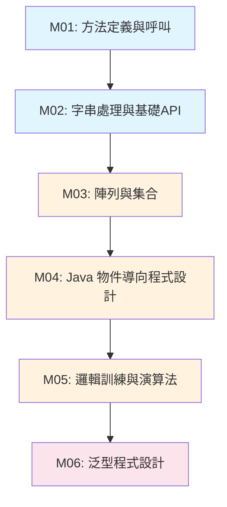

# Java 程式設計完整課程大綱

## 📚 課程概述

本課程是一個全面的 Java 程式設計教學體系，從基礎語法到高級程式設計概念，為學習者提供結構化的學習路徑。課程設計注重理論與實踐相結合，每個模組都包含豐富的範例程式碼、練習題目和實際應用場景。

### 🎯 課程目標

完成本課程後，學習者將能夠：
- 熟練掌握 Java 核心語法和程式設計概念
- 運用物件導向程式設計思維解決實際問題
- 理解並應用資料結構和演算法
- 編寫高品質、可維護的 Java 程式碼
- 具備中級到高級的 Java 開發能力

### 📈 學習路徑設計

```
基礎階段 (Foundation) → 中級階段 (Intermediate) → 高級階段 (Advanced)
     ↓                         ↓                         ↓
 語法基礎與方法              物件導向與資料結構           泛型與高級程式設計
```

---

## 🗂️ 課程模組索引

### 📊 模組總覽表

| 模組編號 | 模組名稱 | 英文名稱 | 學習階段 | 預估學習時間 | 難度等級 |
|---------|---------|---------|---------|------------|---------|
| **M01** | [方法定義與呼叫](#m01-方法定義與呼叫) | Methods and Functions | 基礎 | 8-12 小時 | ⭐⭐ |
| **M02** | [字串處理與基礎API](#m02-字串處理與基礎api) | String Processing and Basic APIs | 基礎 | 10-15 小時 | ⭐⭐ |
| **M03** | [陣列與集合](#m03-陣列與集合) | Arrays and Collections | 基礎-中級 | 15-20 小時 | ⭐⭐⭐ |
| **M04** | [Java 物件導向程式設計](#m04-java-物件導向程式設計) | Java Object-Oriented Programming | 中級 | 25-35 小時 | ⭐⭐⭐⭐ |
| **M05** | [邏輯訓練與演算法](#m05-邏輯訓練與演算法) | Logic Training and Algorithms | 中級 | 12-18 小時 | ⭐⭐⭐ |
| **M06** | [泛型程式設計](#m06-泛型程式設計) | Generics Programming | 高級 | 15-25 小時 | ⭐⭐⭐⭐⭐ |

---

## 📋 詳細模組介紹

### M01: 方法定義與呼叫
**📂 目錄**: `methods-and-functions/`  
**🎯 學習階段**: 基礎 (Foundation)  
**⏱️ 預估時間**: 8-12 小時  
**📊 難度等級**: ⭐⭐

#### 📖 模組概述
本模組是 Java 程式設計的基石，專注於方法的定義、調用和最佳實踐。學習者將掌握模組化程式設計的核心概念，為後續學習打下堅實基礎。

#### 🎯 學習目標
- [ ] 理解方法的語法結構和組成元素
- [ ] 掌握參數傳遞機制（值傳遞 vs 引用傳遞）
- [ ] 熟練使用方法多載（Overloading）
- [ ] 理解遞歸概念及其應用
- [ ] 遵循方法設計的最佳實踐

#### 📚 主要內容
1. **方法基礎語法** - 定義、調用、參數和回傳值
2. **參數傳遞機制** - 基本型別 vs 物件引用的傳遞
3. **方法多載** - 同名方法的不同實作
4. **可變參數** - Varargs 的使用和應用
5. **遞歸方法** - 自我調用的程式設計技巧
6. **最佳實踐** - 命名規範、錯誤處理、效能考量

#### 🔗 前置條件
- Java 基本語法（變數、資料型別、控制結構）
- IDE 環境配置

#### ➡️ 後續銜接
- M02: 字串處理 (方法的實際應用)
- M04: 物件導向 (類別中的方法)

---

### M02: 字串處理與基礎API
**📂 目錄**: `string-processing/`  
**🎯 學習階段**: 基礎 (Foundation)  
**⏱️ 預估時間**: 10-15 小時  
**📊 難度等級**: ⭐⭐

#### 📖 模組概述
深入探討 Java 中的字串處理機制，從 String 類別的內部實作到實際應用場景。本模組強調實用性，提供大量的文本處理工具和技巧。

#### 🎯 學習目標
- [ ] 理解 String 的不可變性和字串常量池機制
- [ ] 熟練使用 String、StringBuilder、StringBuffer
- [ ] 掌握 Scanner 進行各種輸入處理
- [ ] 熟練使用格式化輸出（printf、String.format）
- [ ] 理解並應用基本正則表達式
- [ ] 了解字串操作的效能考量

#### 📚 主要內容
1. **String 類別基礎** - 特性、創建方式、常量池機制
2. **字串操作方法** - 比較、搜尋、分割、替換
3. **StringBuilder/StringBuffer** - 可變字串的高效操作
4. **Scanner 輸入處理** - 控制台輸入、文件讀取、資料驗證
5. **格式化輸出** - printf、DecimalFormat、模式設計
6. **正則表達式** - 基本語法、群組捕獲、實際應用
7. **效能最佳化** - 記憶體使用、操作效率、最佳實踐

#### 💻 實際應用場景
- 文本處理工具開發
- 配置文件解析器設計
- 資料驗證和格式化
- 日誌處理和分析

#### 🔗 前置條件
- M01: 方法定義與呼叫

#### ➡️ 後續銜接
- M03: 陣列與集合 (字串與集合的整合應用)
- M04: 物件導向 (字串在類別設計中的應用)

---

### M03: 陣列與集合
**📂 目錄**: `arrays-and-collections/`  
**🎯 學習階段**: 基礎-中級 (Foundation-Intermediate)  
**⏱️ 預估時間**: 15-20 小時  
**📊 難度等級**: ⭐⭐⭐

#### 📖 模組概述
本模組涵蓋 Java 中所有重要的資料結構，從基本陣列到 Java Collections Framework 的各種實作。注重理論與實踐結合，包含詳細的效能分析和選擇指南。

#### 🎯 學習目標
- [ ] 掌握陣列的創建、操作和多維陣列處理
- [ ] 熟練使用 List、Set、Map、Queue/Deque 介面
- [ ] 理解不同集合實作的效能特性和適用場景
- [ ] 能夠根據需求選擇合適的資料結構
- [ ] 掌握集合的遍歷、搜尋、排序操作

#### 📚 主要內容

##### 01. 陣列基礎 (`01-arrays/`)
- **基本陣列操作** - 創建、初始化、存取、遍歷
- **Arrays 工具類** - 排序、搜尋、比較、轉換
- **多維陣列** - 二維陣列、不規則陣列、實際應用

##### 02. List 集合 (`02-list/`)
- **ArrayList** - 動態陣列實作、擴容機制、效能分析
- **LinkedList** - 鏈結串列實作、雙向鏈結、應用場景
- **Vector** - 執行緒安全的 List、與 ArrayList 比較

##### 03. Set 集合 (`03-set/`)
- **HashSet** - 雜湊表實作、去重原理、效能特性
- **LinkedHashSet** - 維持插入順序的 Set
- **TreeSet** - 自動排序的 Set、Comparable/Comparator

##### 04. Map 集合 (`04-map/`)
- **HashMap** - 鍵值對映射、雜湊衝突處理、效能分析
- **LinkedHashMap** - 維持順序的 Map
- **TreeMap** - 自動排序的 Map、紅黑樹實作

##### 05. Queue/Deque (`05-queue-deque/`)
- **Queue 介面** - 佇列操作、FIFO 原理
- **Deque 介面** - 雙端佇列、ArrayDeque 實作
- **PriorityQueue** - 優先佇列、堆積資料結構

#### 📊 效能比較總表

| 操作 | ArrayList | LinkedList | HashSet | HashMap | TreeMap |
|------|-----------|------------|---------|---------|---------|
| 隨機存取 | O(1) | O(n) | - | O(1) | O(log n) |
| 順序插入 | O(1)* | O(1) | O(1) | O(1) | O(log n) |
| 隨機插入 | O(n) | O(1)** | O(1) | O(1) | O(log n) |
| 刪除 | O(n) | O(1)** | O(1) | O(1) | O(log n) |
| 搜尋 | O(n) | O(n) | O(1) | O(1) | O(log n) |

*平均情況，最壞 O(n)（擴容時）  
**已知節點位置時

#### 🔗 前置條件
- M01: 方法定義與呼叫
- M02: 字串處理與基礎API

#### ➡️ 後續銜接
- M04: 物件導向 (集合與物件的整合應用)
- M05: 邏輯訓練 (演算法中的資料結構應用)
- M06: 泛型程式設計 (泛型集合的深入理解)

---

### M04: Java 物件導向程式設計
**📂 目錄**: `java-oop/`  
**🎯 學習階段**: 中級 (Intermediate)  
**⏱️ 預估時間**: 25-35 小時  
**📊 難度等級**: ⭐⭐⭐⭐

#### 📖 模組概述
這是本課程的核心模組，全面涵蓋物件導向程式設計的所有重要概念。從基本的類別和物件到高級的設計模式，幫助學習者建立完整的 OOP 思維體系。

#### 🎯 學習目標
- [ ] 深入理解物件導向的核心概念（封裝、繼承、多型）
- [ ] 熟練設計和實作類別、介面、抽象類別
- [ ] 掌握 Java 的記憶體管理和物件生命週期
- [ ] 理解並應用常見的設計模式
- [ ] 能夠進行模組化的程式設計架構設計

#### 📚 主要內容 (13個主題)

##### 01. 類別與物件基礎 (`01-classes-objects/`)
- 類別定義與物件創建
- 屬性和方法設計
- 建構子與物件初始化

##### 02. 封裝原理 (`02-encapsulation/`)
- 存取修飾符的使用
- Getter/Setter 方法設計
- 資料隱藏與介面暴露

##### 03. 繼承機制 (`03-inheritance/`)
- extends 關鍵字使用
- 方法覆寫與 super 關鍵字
- 繼承層次設計原則

##### 04. 多型應用 (`04-polymorphism/`)
- 方法覆寫與動態綁定
- 向上轉型與向下轉型
- instanceof 運算子

##### 05. 抽象類別與介面 (`05-abstract-interface/`)
- abstract 類別設計
- interface 定義與實作
- 多重繼承的實現

##### 06. 靜態成員與工具類別 (`06-static-members/`)
- static 變數與方法
- 靜態初始化區塊
- 工具類別設計模式

##### 07. 內部類別 (`07-inner-classes/`)
- 成員內部類別
- 區域內部類別
- 匿名內部類別

##### 08. 異常處理 (`08-exception-handling/`)
- try-catch-finally 結構
- 自定義異常類別
- 異常鏈與最佳實踐

##### 09. Java 記憶體模型 (`09-memory-model/`)
- 堆疊與堆積記憶體
- 物件生命週期
- 垃圾收集機制

##### 10. equals 與 hashCode (`10-equals-hashcode/`)
- Object 類別的核心方法
- 相等性比較的正確實作
- 雜湊碼的設計原則

##### 11. 設計模式基礎 (`11-design-patterns/`)
- 單例模式 (Singleton)
- 工廠模式 (Factory)
- 觀察者模式 (Observer)

##### 12. 列舉與註解 (`12-enum-annotations/`)
- enum 類型設計
- 註解的定義與使用
- 反射機制基礎

##### 13. 迴圈與遞迴 (`13-loops-recursion/`) ⭐ *新增*
- 迴圈設計原則與最佳化
- 遞迴概念與應用場景
- 迭代 vs 遞迴選擇策略
- 遞迴除錯技巧與常見陷阱

#### 🏗️ 設計模式應用
本模組特別強調設計模式的實際應用，包含：
- **創建型模式**: 單例、工廠、建造者
- **結構型模式**: 介面卡、裝飾者、外觀
- **行為型模式**: 觀察者、策略、模板方法

#### 🔗 前置條件
- M01: 方法定義與呼叫
- M02: 字串處理與基礎API
- M03: 陣列與集合 (基礎部分)

#### ➡️ 後續銜接
- M05: 邏輯訓練 (物件導向的演算法設計)
- M06: 泛型程式設計 (類型安全的物件導向程式設計)

---

### M05: 邏輯訓練與演算法
**📂 目錄**: `logic-training/`  
**🎯 學習階段**: 中級 (Intermediate)  
**⏱️ 預估時間**: 12-18 小時  
**📊 難度等級**: ⭐⭐⭐

#### 📖 模組概述
本模組專注於演算法思維的培養和基礎演算法的實作。透過經典的搜尋和排序演算法，幫助學習者建立紮實的程式邏輯思維和問題解決能力。

#### 🎯 學習目標
- [ ] 理解基本演算法的設計思想和實作原理
- [ ] 掌握時間複雜度和空間複雜度的分析方法
- [ ] 熟練實作各種搜尋和排序演算法
- [ ] 培養演算法選擇和最佳化的判斷能力
- [ ] 建立解決複雜問題的邏輯思維

#### 📚 主要內容

##### 01. 搜尋演算法 (`01-search/`)
**包含範例**: `BinarySearch.java`

- **線性搜尋 (Linear Search)**
  - 概念與實作
  - 時間複雜度：O(n)
  - 適用場景：無序資料

- **二元搜尋 (Binary Search)**
  - 分治法思想
  - 時間複雜度：O(log n)
  - 前提條件：已排序資料

##### 02. 排序演算法 (`02-sorting/`)
**包含範例**: `BubbleSort.java`, `InsertionSort.java`

- **泡泡排序 (Bubble Sort)**
  - 相鄰元素比較交換
  - 時間複雜度：O(n²)
  - 穩定性：穩定

- **選擇排序 (Selection Sort)**
  - 選擇最小元素交換
  - 時間複雜度：O(n²)
  - 交換次數少

- **插入排序 (Insertion Sort)**
  - 逐一插入已排序序列
  - 時間複雜度：最佳 O(n)，最壞 O(n²)
  - 適合小規模或部分有序資料

#### 📊 演算法效能比較

| 演算法 | 最佳時間 | 平均時間 | 最壞時間 | 空間複雜度 | 穩定性 |
|--------|----------|----------|----------|------------|--------|
| 線性搜尋 | O(1) | O(n) | O(n) | O(1) | - |
| 二元搜尋 | O(1) | O(log n) | O(log n) | O(1) | - |
| 泡泡排序 | O(n) | O(n²) | O(n²) | O(1) | 穩定 |
| 選擇排序 | O(n²) | O(n²) | O(n²) | O(1) | 不穩定 |
| 插入排序 | O(n) | O(n²) | O(n²) | O(1) | 穩定 |

#### 💡 演算法設計原則
1. **正確性** - 演算法必須能正確解決問題
2. **效率性** - 考慮時間和空間複雜度
3. **可讀性** - 程式碼清晰易懂
4. **健壯性** - 能處理邊界條件和異常情況

#### 🔗 前置條件
- M01: 方法定義與呼叫
- M03: 陣列與集合
- M04: Java 物件導向程式設計

#### ➡️ 後續銜接
- M06: 泛型程式設計 (泛型演算法的設計)
- 高級演算法課程 (圖論、動態規劃等)

---

### M06: 泛型程式設計
**📂 目錄**: `generics-programming/`  
**🎯 學習階段**: 高級 (Advanced)  
**⏱️ 預估時間**: 15-25 小時  
**📊 難度等級**: ⭐⭐⭐⭐⭐

#### 📖 模組概述
本模組是課程的高級階段，深入探討 Java 泛型程式設計的各個面向。從基本的泛型語法到高級的通配符使用，幫助學習者掌握類型安全的程式設計技巧和工具。

#### 🎯 學習目標
- [ ] 深入理解泛型的設計理念和類型安全機制
- [ ] 熟練使用泛型類別、介面和方法
- [ ] 掌握通配符和邊界的高級應用
- [ ] 理解類型擦除機制及其影響
- [ ] 能夠設計類型安全的程式庫和框架

#### 📚 主要內容

##### 01. 泛型基礎 (`01-generics-basics/`)
**包含範例**: `GenericsBasicsDemo.java`

- **泛型概念** - 類型參數化的理念
- **基本語法** - `<T>` 類型參數定義
- **類型安全** - 編譯時期類型檢查
- **類型擦除** - 執行時期的類型訊息

##### 02. 泛型類別 (`02-generic-classes/`)
- **泛型類別設計** - 類型參數的定義和使用
- **多類型參數** - `<T, U, V>` 的應用
- **邊界約束** - `extends` 和 `super` 關鍵字
- **內部類別泛型** - 巢狀泛型結構

##### 03. 泛型方法 (`03-generic-methods/`)
- **靜態泛型方法** - 獨立於類別的泛型
- **實例泛型方法** - 與物件相關的泛型
- **類型推斷** - 自動類型判斷機制
- **方法覆寫** - 泛型方法的繼承

##### 04. 通配符 (`04-wildcards/`)
- **上邊界通配符** - `? extends T` (PECS 的 Producer)
- **下邊界通配符** - `? super T` (PECS 的 Consumer)
- **無界通配符** - `?` 的使用場景
- **PECS 原則** - Producer Extends, Consumer Super

#### 🛠️ 高級應用範例

本模組包含大量實際應用範例：

**泛型設計模式**:
- `GenericSingleton.java` - 泛型單例模式
- `GenericDAO.java` - 泛型資料存取物件
- `GenericCache.java` - 泛型快取系統

**泛型工具類別**:
- `GenericComparator.java` - 泛型比較器
- `GenericCollectionUtils.java` - 泛型集合工具
- `Transformer.java` - 泛型轉換器

**高級泛型結構**:
- `BinaryTree.java` - 泛型二元樹
- `GenericStack.java` - 泛型堆疊
- `Pipeline.java` - 泛型管道模式

#### 🔬 深入主題

- **反射與泛型** - `ReflectionExample.java`
- **類型擦除影響** - `TypeErasureExample.java`
- **泛型陣列建立** - `GenericArrayCreator.java`
- **事件處理系統** - `EventBus.java`, `EventProcessor.java`

#### 📋 PECS 原則詳解

```java
// Producer Extends - 生產者使用上邊界
List<? extends Number> numbers = new ArrayList<Integer>();

// Consumer Super - 消費者使用下邊界  
List<? super Integer> integers = new ArrayList<Number>();
```

#### 🔗 前置條件
- M04: Java 物件導向程式設計 (深度理解)
- M03: 陣列與集合 (Collection Framework)
- M05: 邏輯訓練 (可選，有助於理解泛型演算法)

#### ➡️ 後續銜接
- Spring Framework (依賴注入和泛型)
- 函數式程式設計 (Lambda 與泛型結合)
- 進階框架開發

---

## 🛣️ 學習路徑建議

### 🎯 完整學習路徑 (建議順序)



### 📚 階段性學習計畫

#### 第一階段：基礎建構 (3-5 週)
**目標**: 建立 Java 程式設計基礎
- **M01: 方法定義與呼叫** (1-1.5 週)
- **M02: 字串處理與基礎API** (1.5-2 週)
- **M03: 陣列與集合** (基礎部分，1-1.5 週)

**檢查點**: 能夠編寫結構化的 Java 程式，處理基本的資料操作

#### 第二階段：核心掌握 (4-6 週)  
**目標**: 掌握物件導向程式設計核心
- **M03: 陣列與集合** (進階部分，1 週)
- **M04: Java 物件導向程式設計** (3-4 週)
- **M05: 邏輯訓練與演算法** (1-1.5 週)

**檢查點**: 能夠設計物件導向的解決方案，實作基礎演算法

#### 第三階段：高級進階 (2-3 週)
**目標**: 掌握高級程式設計技巧
- **M06: 泛型程式設計** (2-3 週)

**檢查點**: 能夠設計類型安全的程式庫和框架

### 🔄 彈性學習路徑

#### 快速入門路徑 (適合有程式設計經驗者)
```
M01 (重點) → M04 (核心) → M06 (進階)
M02, M03, M05 (平行學習或快速瀏覽)
```

#### 紮實基礎路徑 (適合初學者)
```
M01 → M02 → M03 → M04 → M05 → M06
(每個模組都要完整學習，多做練習)
```

#### 專項強化路徑
- **演算法專精**: M01 → M03 → M05 → M04 → M06
- **框架開發**: M01 → M04 → M06 → M02, M03, M05

---

## 📊 學習評估與檢查點

### 🎯 每個模組的評估標準

#### M01: 方法定義與呼叫
- [ ] 能夠設計和實作各種類型的方法
- [ ] 理解參數傳遞機制的差異
- [ ] 正確使用方法多載和遞歸
- [ ] 遵循方法設計的最佳實踐

#### M02: 字串處理與基礎API  
- [ ] 熟練操作 String 和 StringBuilder
- [ ] 能夠處理複雜的輸入輸出需求
- [ ] 掌握基本正則表達式的應用
- [ ] 理解字串操作的效能考量

#### M03: 陣列與集合
- [ ] 根據需求選擇合適的資料結構
- [ ] 理解各種集合的效能特性
- [ ] 能夠實作集合相關的演算法
- [ ] 掌握集合的高級操作技巧

#### M04: Java 物件導向程式設計
- [ ] 能夠設計良好的類別層次結構
- [ ] 正確實作封裝、繼承、多型
- [ ] 理解設計模式並能夠應用
- [ ] 掌握 Java 記憶體模型和生命週期

#### M05: 邏輯訓練與演算法
- [ ] 能夠分析演算法的時間和空間複雜度
- [ ] 熟練實作基本的搜尋和排序演算法
- [ ] 具備解決複雜問題的邏輯思維
- [ ] 能夠選擇和最佳化演算法

#### M06: 泛型程式設計
- [ ] 深入理解泛型的設計理念
- [ ] 熟練使用各種泛型語法和通配符
- [ ] 能夠設計類型安全的程式庫
- [ ] 理解類型擦除的影響和處理方法

### 📋 綜合專案建議

完成所有模組後，建議實作以下綜合專案來驗證學習成果：

1. **學生管理系統** (整合 M01-M04)
   - 使用物件導向設計學生、課程、成績類別
   - 實作各種搜尋和排序功能
   - 提供文件輸入輸出功能

2. **泛型資料結構庫** (整合 M03-M06)  
   - 實作泛型版本的常用資料結構
   - 提供類型安全的演算法介面
   - 支援自定義比較器和轉換器

3. **文本分析工具** (整合 M02, M05)
   - 實作文本讀取和預處理
   - 提供詞頻統計和關鍵字搜尋
   - 支援多種輸出格式

---

## 🔧 開發環境與工具

### 💻 建議開發環境
- **IDE**: IntelliJ IDEA 或 Eclipse
- **Java 版本**: Java 8 或以上 (建議 Java 11/17 LTS)
- **建構工具**: Maven 或 Gradle (可選)
- **版本控制**: Git

### 📚 推薦學習資源
- **官方文件**: [Oracle Java Documentation](https://docs.oracle.com/javase/)
- **編碼風格**: [Google Java Style Guide](https://google.github.io/styleguide/javaguide.html)
- **練習平台**: LeetCode, HackerRank, Codewars

### 🛠️ 實作建議
- 每個範例程式都要親手實作一次
- 完成練習題目並編寫測試案例
- 建立個人的程式碼庫進行版本控制
- 定期重構和最佳化程式碼

---

## 📞 學習支援

### 🤝 學習社群
- 建立學習小組進行討論和程式碼審查
- 參與開源專案實踐所學技能
- 加入 Java 相關的技術社群

### 📖 深入學習方向
完成本課程後，可以繼續學習：
- **Spring Framework** - 企業級應用開發
- **並發程式設計** - 多執行緒和並行處理
- **JVM 調優** - 效能分析和最佳化
- **微服務架構** - 分散式系統設計
- **函數式程式設計** - Java 8+ Stream API 和 Lambda

---

## 📝 結語

本課程大綱提供了一個完整而系統的 Java 學習路徑，從基礎語法到高級程式設計概念。每個模組都經過精心設計，包含豐富的範例程式碼和實際應用場景。

**成功的關鍵在於**：
- 🎯 **循序漸進** - 按照建議的順序學習，打好基礎
- 💻 **動手實踐** - 每個概念都要透過程式碼實作來理解
- 🔄 **持續練習** - 定期回顧和練習已學內容
- 🤝 **交流討論** - 與其他學習者分享經驗和問題

祝願每位學習者都能在 Java 程式設計的路上取得優異的成果！ 🚀

---

*最後更新日期: 2024年3月*  
*課程版本: v2.0*  
*總計學習時間: 85-125 小時*