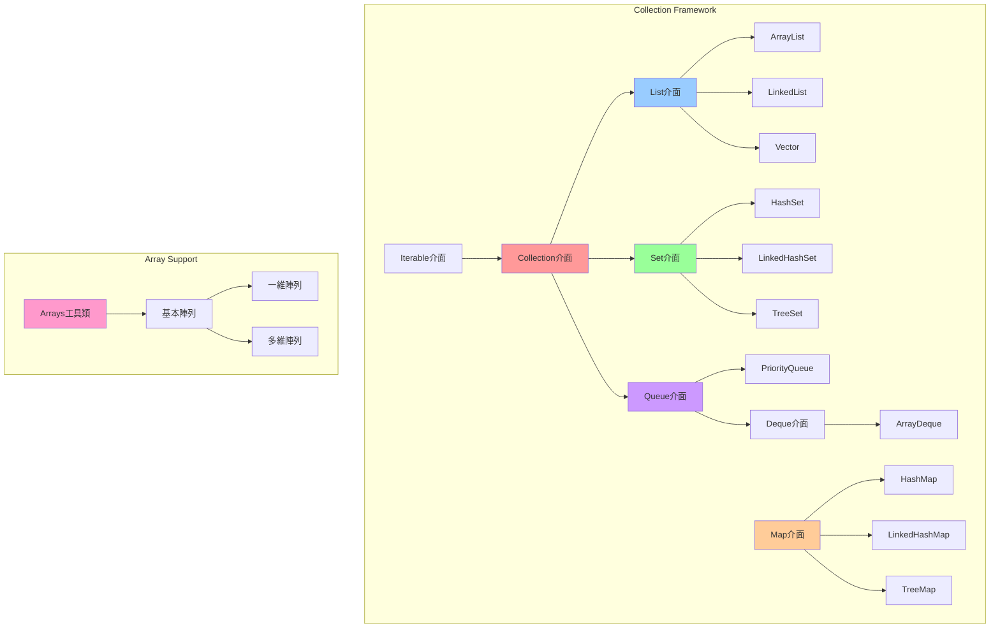
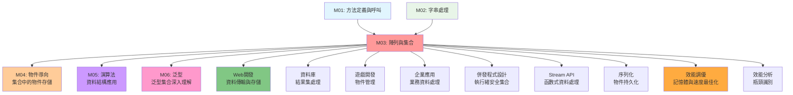

# 陣列與集合 - UML概念圖

## 📊 集合框架整體架構



## 🔄 資料結構選擇決策樹

```mermaid
flowchart TD
    Start([需要存儲資料]) --> DataType{資料類型}
    
    DataType -->|原始陣列| ArrayDecision{資料大小}
    DataType -->|集合類型| CollectionDecision{存儲特性}
    
    ArrayDecision -->|固定大小| FixedArray[基本陣列 int[]]
    ArrayDecision -->|動態大小| DynamicArray[考慮ArrayList]
    
    CollectionDecision -->|需要索引| IndexRequired[List類型]
    CollectionDecision -->|不重複| UniqueRequired[Set類型]
    CollectionDecision -->|鍵值對應| KeyValue[Map類型]
    CollectionDecision -->|佇列操作| QueueOps[Queue/Deque類型]
    
    IndexRequired --> ListDecision{存取模式}
    ListDecision -->|隨機存取| ArrayListChoice[ArrayList]
    ListDecision -->|順序存取| LinkedListChoice[LinkedList]
    ListDecision -->|執行緒安全| VectorChoice[Vector/Collections.synchronizedList]
    
    UniqueRequired --> SetDecision{排序需求}
    SetDecision -->|無需排序| HashSetChoice[HashSet]
    SetDecision -->|維持插入順序| LinkedHashSetChoice[LinkedHashSet]
    SetDecision -->|自動排序| TreeSetChoice[TreeSet]
    
    KeyValue --> MapDecision{效能需求}
    MapDecision -->|高效能| HashMapChoice[HashMap]
    MapDecision -->|維持順序| LinkedHashMapChoice[LinkedHashMap]
    MapDecision -->|排序鍵| TreeMapChoice[TreeMap]
    
    QueueOps --> QueueDecision{操作類型}
    QueueDecision -->|FIFO| QueueImpl[ArrayDeque]
    QueueDecision -->|優先權| PriorityQueueImpl[PriorityQueue]
    QueueDecision -->|雙端操作| DequeImpl[ArrayDeque]
    
    style Start fill:#e1f5fe
    style DataType fill:#fff3e0
    style CollectionDecision fill:#fff3e0
    style ListDecision fill:#fff3e0
    style SetDecision fill:#fff3e0
    style MapDecision fill:#fff3e0
    style QueueDecision fill:#fff3e0
```

## 📈 效能特性比較矩陣

```mermaid
graph TD
    subgraph "時間複雜度比較"
        Performance[效能比較] --> Access[隨機存取]
        Performance --> Insert[插入操作]
        Performance --> Delete[刪除操作]
        Performance --> Search[搜尋操作]
        
        Access --> AccessMatrix[
            ArrayList: O(1)<br/>
            LinkedList: O(n)<br/>
            HashMap: O(1)<br/>
            TreeMap: O(log n)
        ]
        
        Insert --> InsertMatrix[
            ArrayList: O(1) 平均, O(n) 最壞<br/>
            LinkedList: O(1) 已知位置<br/>
            HashMap: O(1) 平均<br/>
            TreeMap: O(log n)
        ]
        
        Delete --> DeleteMatrix[
            ArrayList: O(n)<br/>
            LinkedList: O(1) 已知節點<br/>
            HashMap: O(1) 平均<br/>
            TreeMap: O(log n)
        ]
        
        Search --> SearchMatrix[
            ArrayList: O(n)<br/>
            LinkedList: O(n)<br/>
            HashMap: O(1) 平均<br/>
            TreeMap: O(log n)
        ]
    end
    
    subgraph "記憶體使用特性"
        Memory[記憶體特性] --> Overhead[額外開銷]
        Memory --> Locality[局部性]
        
        Overhead --> OverheadMatrix[
            ArrayList: 低開銷<br/>
            LinkedList: 高開銷 (節點指標)<br/>
            HashMap: 中等開銷 (hash table)<br/>
            TreeMap: 中等開銷 (樹節點)
        ]
        
        Locality --> LocalityMatrix[
            ArrayList: 優秀 (連續記憶體)<br/>
            LinkedList: 差 (分散節點)<br/>
            HashMap: 中等 (bucket array)<br/>
            TreeMap: 中等 (樹結構)
        ]
    end
    
    style Performance fill:#ff9999
    style Memory fill:#99ccff
```

## 🎯 學習路徑與技能發展

```mermaid
graph LR
    subgraph "基礎階段 (Foundation)"
        F1[陣列基礎] --> F2[Arrays工具類]
        F2 --> F3[多維陣列]
        F3 --> F4[ArrayList基礎]
    end
    
    subgraph "發展階段 (Development)"
        D1[List介面理解] --> D2[Set去重概念]
        D2 --> D3[Map鍵值對應]
        D3 --> D4[Iterator遍歷]
        D4 --> D5[基本CRUD操作]
    end
    
    subgraph "進階階段 (Advanced)"
        A1[效能分析] --> A2[最佳實作選擇]
        A2 --> A3[自定義Comparator]
        A3 --> A4[集合轉換]
        A4 --> A5[Stream API整合]
    end
    
    subgraph "專家階段 (Expert)"
        E1[記憶體優化] --> E2[併發集合]
        E2 --> E3[自定義資料結構]
        E3 --> E4[集合框架設計]
    end
    
    F4 --> D1
    D5 --> A1
    A5 --> E1
    
    style F1 fill:#c8e6c9
    style D1 fill:#81c784
    style A1 fill:#4caf50
    style E1 fill:#2e7d32
```



## 🔧 實際應用場景流程

```mermaid
graph TD
    subgraph "資料收集與處理"
        Scenario1[用戶資料收集] --> S1Process[使用List存儲]
        S1Process --> S1Filter[過濾重複 - Set]
        S1Filter --> S1Index[建立索引 - Map]
        S1Index --> S1Result[結果輸出]
    end
    
    subgraph "快取系統設計"
        Scenario2[快取需求] --> S2Choose[選擇Map結構]
        S2Choose --> S2LRU[LRU策略 - LinkedHashMap]
        S2LRU --> S2Access[快速存取 - HashMap]
        S2Access --> S2Expire[過期處理]
    end
    
    subgraph "任務佇列處理"
        Scenario3[任務排程] --> S3Queue[使用Queue]
        S3Queue --> S3Priority[優先權 - PriorityQueue]
        S3Priority --> S3Process[任務處理]
        S3Process --> S3Complete[完成追蹤 - Set]
    end
    
    subgraph "搜尋與排序"
        Scenario4[資料查詢] --> S4Structure[選擇資料結構]
        S4Structure --> S4Search[搜尋演算法]
        S4Search --> S4Sort[排序要求]
        S4Sort --> S4Optimize[效能優化]
    end
    
    style Scenario1 fill:#ffcdd2
    style Scenario2 fill:#f8bbd9
    style Scenario3 fill:#e1bee7
    style Scenario4 fill:#d1c4e9
```



## 🏗️ 內部實作原理

```mermaid
graph TB
    subgraph "ArrayList 內部結構"
        AL[ArrayList] --> ALArray[Object[] elementData]
        AL --> ALSize[int size]
        AL --> ALCapacity[capacity 管理]
        ALCapacity --> ALGrow[擴容機制: 1.5倍]
    end
    
    subgraph "LinkedList 內部結構"
        LL[LinkedList] --> LLFirst[Node first]
        LL --> LLLast[Node last]
        LL --> LLSize[int size]
        LLFirst --> LLNode[Node<E>]
        LLNode --> LLItem[E item]
        LLNode --> LLNext[Node next]
        LLNode --> LLPrev[Node prev]
    end
    
    subgraph "HashMap 內部結構"
        HM[HashMap] --> HMTable[Node<K,V>[] table]
        HM --> HMSize[int size]
        HM --> HMThreshold[int threshold]
        HMTable --> HMBucket[Bucket (鏈表/紅黑樹)]
        HMBucket --> HMHash[hash() 函數]
        HMHash --> HMCollision[衝突處理]
    end
    
    subgraph "TreeMap 內部結構"
        TM[TreeMap] --> TMRoot[TreeNode root]
        TM --> TMComparator[Comparator]
        TM --> TMSize[int size]
        TMRoot --> TMNode[TreeNode]
        TMNode --> TMKey[K key]
        TMNode --> TMValue[V value]
        TMNode --> TMLeft[left child]
        TMNode --> TMRight[right child]
        TMNode --> TMColor[color (紅黑樹)]
    end
    
    style AL fill:#ff9999
    style LL fill:#99ccff
    style HM fill:#99ff99
    style TM fill:#ffcc99
```

## 🔗 與其他模組的關聯

