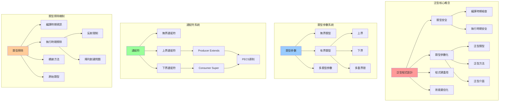

# 泛型程式設計 - UML概念圖

## 📊 泛型系統整體架構



## 🔄 泛型設計決策流程

```mermaid
flowchart TD
    Start([泛型設計需求]) --> Question1{需要類型安全?}
    
    Question1 -->|否| RawTypes[使用原始類型]
    Question1 -->|是| Question2{設計範圍}
    
    Question2 -->|單一類別| GenericClass[泛型類別設計]
    Question2 -->|單一方法| GenericMethod[泛型方法設計]
    Question2 -->|介面定義| GenericInterface[泛型介面設計]
    
    GenericClass --> ClassTypeParams{類型參數數量}
    ClassTypeParams -->|單一| SingleParam[<T>]
    ClassTypeParams -->|多個| MultipleParams1[<T, U, V>]
    
    GenericMethod --> MethodScope{方法範圍}
    MethodScope -->|靜態方法| StaticGeneric[static <T> T method()]
    MethodScope -->|實例方法| InstanceGeneric[<T> T method()]
    
    GenericInterface --> InterfaceDesign{介面特性}
    InterfaceDesign -->|功能介面| FunctionalInterface[Function<T,R>]
    InterfaceDesign -->|集合介面| CollectionInterface[Collection<E>]
    
    SingleParam --> Bounds{需要類型限制?}
    MultipleParams1 --> Bounds
    
    Bounds -->|無限制| Unbounded[T]
    Bounds -->|上界限制| UpperBound[T extends SuperType]
    Bounds -->|下界限制| LowerBound[? super T]
    Bounds -->|多重限制| MultipleBounds1[T extends A & B]
    
    StaticGeneric --> WildcardDecision{需要通配符?}
    InstanceGeneric --> WildcardDecision
    FunctionalInterface --> WildcardDecision
    CollectionInterface --> WildcardDecision
    
    WildcardDecision -->|讀取操作| ProducerPattern[<? extends T>]
    WildcardDecision -->|寫入操作| ConsumerPattern[<? super T>]
    WildcardDecision -->|未知類型| UnboundedWildcard1[<?>]
    WildcardDecision -->|確定類型| ConcreteType[具體類型]
    
    ProducerPattern --> PECS1[PECS原則應用]
    ConsumerPattern --> PECS1
    
    PECS1 --> Implementation[實作泛型]
    UnboundedWildcard1 --> Implementation
    ConcreteType --> Implementation
    Unbounded --> Implementation
    UpperBound --> Implementation
    LowerBound --> Implementation
    MultipleBounds1 --> Implementation
    
    Implementation --> Testing[測試類型安全]
    Testing --> Documentation[文件化泛型設計]
    Documentation --> End([完成設計])
    
    style Start fill:#e1f5fe
    style End fill:#c8e6c9
    style Question1 fill:#fff3e0
    style Question2 fill:#fff3e0
    style Bounds fill:#fff3e0
    style WildcardDecision fill:#fff3e0
    style PECS1 fill:#ffeb3b
```

## 📋 PECS原則詳解與應用

```mermaid
graph TB
    subgraph "PECS 原則 (Producer Extends, Consumer Super)"
        PECS[PECS原則] --> Producer[Producer Extends]
        PECS --> Consumer[Consumer Super]
        
        Producer --> ProducerConcept[
            當你需要從集合中讀取資料時<br/>
            使用 ? extends T<br/>
            集合是資料的生產者
        ]
        
        Consumer --> ConsumerConcept[
            當你需要向集合中寫入資料時<br/>
            使用 ? super T<br/>
            集合是資料的消費者
        ]
    end
    
    subgraph "Producer 範例"
        ProducerExample[Producer 使用案例] --> ReadOperation[讀取操作]
        ReadOperation --> ProducerCode[
            List<? extends Number> numbers<br/>
            可以讀取: Number 及其子類型<br/>
            不能寫入: 類型不確定
        ]
        
        ProducerCode --> ProducerScenarios[
            Collections.max(Collection<? extends T>)<br/>
            Stream.collect(Collector<? super T>)<br/>
            方法參數接收資料
        ]
    end
    
    subgraph "Consumer 範例"
        ConsumerExample[Consumer 使用案例] --> WriteOperation[寫入操作]
        WriteOperation --> ConsumerCode[
            List<? super Integer> numbers<br/>
            可以寫入: Integer 及其子類型<br/>
            讀取受限: 只能當作 Object
        ]
        
        ConsumerCode --> ConsumerScenarios[
            Collections.addAll(Collection<? super T>)<br/>
            Collections.copy(List<? super T>)<br/>
            方法參數接收目標容器
        ]
    end
    
    subgraph "記憶口訣"
        Mnemonic[記憶技巧] --> GetPut[
            GET原則: extends<br/>
            PUT原則: super<br/>
            <br/>
            Producer = 提供資料 = GET = extends<br/>
            Consumer = 接收資料 = PUT = super
        ]
    end
    
    style PECS fill:#ff9999
    style Producer fill:#99ccff
    style Consumer fill:#99ff99
    style Mnemonic fill:#ffcc99
```

## 🎯 泛型學習路徑與技能發展

```mermaid
graph LR
    subgraph "基礎階段 (Foundation)"
        F1[泛型基本概念] --> F2[泛型類別使用]
        F2 --> F3[集合框架泛型]
        F3 --> F4[基本型別參數]
    end
    
    subgraph "發展階段 (Development)"
        D1[自定義泛型類別] --> D2[泛型方法設計]
        D2 --> D3[有界類型參數]
        D3 --> D4[基礎通配符]
        D4 --> D5[PECS原則理解]
    end
    
    subgraph "進階階段 (Advanced)"
        A1[複雜通配符組合] --> A2[類型擦除理解]
        A2 --> A3[反射與泛型]
        A3 --> A4[泛型設計模式]
        A4 --> A5[效能最佳化]
    end
    
    subgraph "專家階段 (Expert)"
        E1[泛型框架設計] --> E2[類型系統設計]
        E2 --> E3[編譯器原理]
        E3 --> E4[語言特性研究]
    end
    
    F4 --> D1
    D5 --> A1
    A5 --> E1
    
    %% 檢查點與回饋循環
    F2 --> Check1{理解泛型語法?}
    Check1 -->|否| F1
    Check1 -->|是| F3
    
    D3 --> Check2{掌握有界類型?}
    Check2 -->|否| D2
    Check2 -->|是| D4
    
    A2 --> Check3{理解類型擦除?}
    Check3 -->|否| A1
    Check3 -->|是| A3
    
    E1 --> Check4{能設計泛型框架?}
    Check4 -->|否| A4
    Check4 -->|是| E2
    
    style F1 fill:#c8e6c9
    style D1 fill:#81c784
    style A1 fill:#4caf50
    style E1 fill:#2e7d32
    style Check1 fill:#fff3e0
    style Check2 fill:#fff3e0
    style Check3 fill:#fff3e0
    style Check4 fill:#fff3e0
```



## 🔧 類型擦除機制與影響

```mermaid
graph TD
    subgraph "編譯時期 (Compile Time)"
        CompileTime[編譯階段] --> GenericCode[泛型程式碼]
        GenericCode --> TypeChecking[類型檢查]
        TypeChecking --> TypeInference[類型推斷]
        TypeInference --> TypeErasureProcess[類型擦除處理]
        
        GenericCode --> GenericSyntax[
            List<String> strings = new ArrayList<>();<br/>
            Map<Integer, Person> people;<br/>
            T getValue() { ... }
        ]
    end
    
    subgraph "類型擦除轉換"
        TypeErasureProcess --> ErasureRules[擦除規則]
        ErasureRules --> UnboundedErasure[無界類型 → Object]
        ErasureRules --> BoundedErasure[有界類型 → 上界類型]
        ErasureRules --> WildcardErasure[通配符 → 上界類型]
        
        UnboundedErasure --> UnboundedExample[
            List<String> → List<br/>
            T → Object<br/>
            Generic<T> → Generic
        ]
        
        BoundedErasure --> BoundedExample[
            <T extends Number> → Number<br/>
            <T extends Comparable> → Comparable<br/>
            <T extends A & B> → A
        ]
    end
    
    subgraph "執行時期 (Runtime)"
        Runtime[執行階段] --> ErasedCode[擦除後程式碼]
        ErasedCode --> CastInsertion[自動插入轉型]
        CastInsertion --> BridgeMethodCreation[橋接方法創建]
        
        ErasedCode --> ErasedSyntax[
            List strings = new ArrayList();<br/>
            Map people;<br/>
            Object getValue() { ... }
        ]
        
        CastInsertion --> AutoCasting[
            String s = (String) list.get(0);<br/>
            自動插入類型轉換
        ]
    end
    
    subgraph "類型擦除的影響"
        Impacts[影響與限制] --> ReflectionLimits[反射限制]
        Impacts --> ArrayLimits[陣列創建限制]
        Impacts --> RuntimeTypeCheck[執行時期類型檢查限制]
        Impacts --> OverloadingLimits[方法重載限制]
        
        ReflectionLimits --> ReflectionExample[
            無法獲取: List<String>.class<br/>
            只能獲取: List.class<br/>
            需要: TypeToken, ParameterizedType
        ]
        
        ArrayLimits --> ArrayExample[
            錯誤: new T[10]<br/>
            錯誤: new List<String>[10]<br/>
            正確: (T[]) new Object[10]
        ]
    end
    
    style CompileTime fill:#ff9999
    style TypeErasureProcess fill:#99ccff
    style Runtime fill:#99ff99
    style Impacts fill:#ffcc99
```

## 🏗️ 高級泛型設計模式

```mermaid
graph TB
    subgraph "創建型泛型模式"
        CreationalPatterns[創建型模式] --> GenericSingleton[泛型單例]
        CreationalPatterns --> GenericFactory[泛型工廠]
        CreationalPatterns --> GenericBuilder[泛型建造者]
        
        GenericSingleton --> SingletonCode[
            class Singleton<T> {<br/>
                private static Singleton<?> instance;<br/>
                @SuppressWarnings("unchecked")<br/>
                public static <T> Singleton<T> getInstance()
            }
        ]
        
        GenericFactory --> FactoryCode[
            interface Factory<T> {<br/>
                T create();<br/>
            }<br/>
            class PersonFactory implements Factory<Person>
        ]
    end
    
    subgraph "行為型泛型模式"
        BehavioralPatterns[行為型模式] --> GenericObserver[泛型觀察者]
        BehavioralPatterns --> GenericStrategy[泛型策略]
        BehavioralPatterns --> GenericCommand[泛型命令]
        
        GenericObserver --> ObserverCode[
            interface Observer<T> {<br/>
                void update(T data);<br/>
            }<br/>
            class Subject<T> { ... }
        ]
        
        GenericStrategy --> StrategyCode[
            interface Strategy<T, R> {<br/>
                R execute(T input);<br/>
            }<br/>
            class Context<T, R> { ... }
        ]
    end
    
    subgraph "結構型泛型模式"
        StructuralPatterns[結構型模式] --> GenericAdapter[泛型介面卡]
        StructuralPatterns --> GenericDecorator[泛型裝飾者]
        StructuralPatterns --> GenericProxy[泛型代理]
        
        GenericAdapter --> AdapterCode[
            class Adapter<T, R> implements Target<R> {<br/>
                private Adaptee<T> adaptee;<br/>
                public R request(T input) { ... }<br/>
            }
        ]
    end
    
    subgraph "函數式泛型模式"
        FunctionalPatterns[函數式模式] --> GenericFunction[泛型函數介面]
        FunctionalPatterns --> MonadPattern[Monad模式]
        FunctionalPatterns --> GenericPipeline[泛型管道]
        
        GenericFunction --> FunctionCode[
            Function<T, R><br/>
            Predicate<T><br/>
            Consumer<T><br/>
            Supplier<T>
        ]
        
        MonadPattern --> MonadCode[
            class Optional<T> {<br/>
                public <R> Optional<R> map(Function<T, R> f)<br/>
                public <R> Optional<R> flatMap(Function<T, Optional<R>> f)<br/>
            }
        ]
    end
    
    style CreationalPatterns fill:#ff9999
    style BehavioralPatterns fill:#99ccff
    style StructuralPatterns fill:#99ff99
    style FunctionalPatterns fill:#ffcc99
```

## 🔗 與其他模組的整合關係

```mermaid
graph TD
    Generics[M06: 泛型程式設計]
    
    %% 前置依賴
    Methods[M01: 方法定義與呼叫] --> Generics
    StringProcessing[M02: 字串處理] --> Generics
    Collections[M03: 陣列與集合] --> Generics
    OOP[M04: Java 物件導向程式設計] --> Generics
    LogicTraining[M05: 邏輯訓練與演算法] --> Generics
    
    %% 核心應用領域
    Generics --> CollectionFramework[集合框架<br/>List<T>, Map<K,V>]
    Generics --> StreamAPI[Stream API<br/>函數式程式設計]
    Generics --> FunctionalInterface[函數式介面<br/>Lambda表達式]
    Generics --> OptionalAPI[Optional<T><br/>空值處理]
    
    %% 框架整合
    Generics --> SpringFramework[Spring框架<br/>依賴注入, RestTemplate<T>]
    Generics --> HibernateORM[Hibernate ORM<br/>泛型DAO, Criteria API]
    Generics --> JacksonJSON[Jackson JSON<br/>TypeReference<T>]
    Generics --> JUnit5[JUnit 5<br/>泛型測試, ParameterizedTest]
    
    %% 高級主題
    Generics --> Reflection[反射機制<br/>ParameterizedType, TypeToken]
    Generics --> Serialization[序列化<br/>泛型物件持久化]
    Generics --> Concurrency[併發程式設計<br/>ExecutorService<T>]
    Generics --> NetworkProgramming[網路程式設計<br/>泛型HTTP客戶端]
    
    %% 設計與架構
    Generics --> LibraryDesign[程式庫設計<br/>API設計原則]
    Generics --> FrameworkDevelopment[框架開發<br/>插件系統, 擴展點]
    Generics --> TypeSafeAPI[類型安全API<br/>編譯時期檢查]
    Generics --> DSLDesign[DSL設計<br/>流暢介面]
    
    %% 效能與最佳化
    Generics --> PerformanceOptimization[效能最佳化<br/>避免裝箱拆箱]
    Generics --> MemoryManagement[記憶體管理<br/>泛型與GC]
    Generics --> CodeGeneration[程式碼生成<br/>註解處理器]
    
    %% 進階語言特性
    Generics --> ModuleSystem[模組系統<br/>Java 9+ 模組化]
    Generics --> RecordClasses[Record類別<br/>Java 14+ 記錄型別]
    Generics --> PatternMatching[模式匹配<br/>instanceof with patterns]
    Generics --> ValueTypes[值類型<br/>Project Valhalla]
    
    style Generics fill:#ff9999
    style Methods fill:#e1f5fe
    style Collections fill:#e3f2fd
    style OOP fill:#fff3e0
    style CollectionFramework fill:#81c784
    style SpringFramework fill:#ffab40
    style LibraryDesign fill:#ba68c8
    style PerformanceOptimization fill:#ff7043
```

