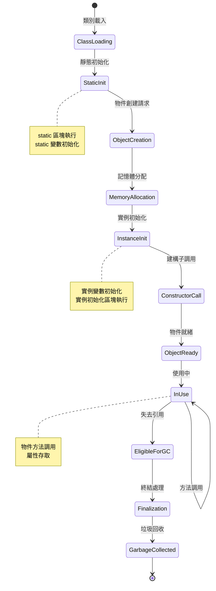
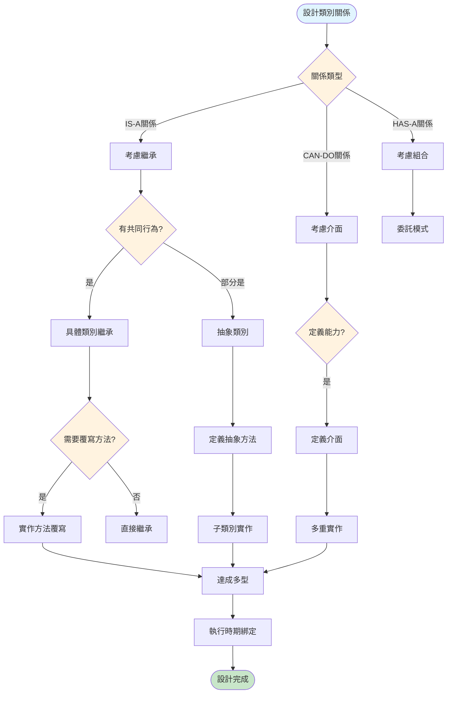
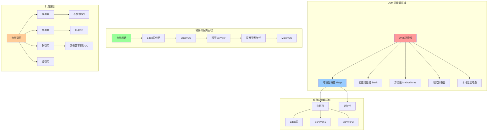
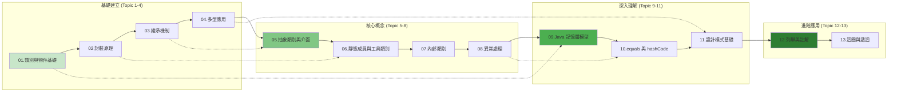

# Java 物件導向程式設計 - UML概念圖

## 📊 OOP 核心概念整體架構

```mermaid
graph TB
    subgraph "物件導向四大支柱"
        OOP[物件導向程式設計] --> Encapsulation[封裝 Encapsulation]
        OOP --> Inheritance[繼承 Inheritance]
        OOP --> Polymorphism[多型 Polymorphism]
        OOP --> Abstraction[抽象 Abstraction]
    end
    
    subgraph "封裝相關概念"
        Encapsulation --> AccessModifier[存取修飾符]
        Encapsulation --> GetterSetter[Getter/Setter]
        Encapsulation --> DataHiding[資料隱藏]
        AccessModifier --> Private[private]
        AccessModifier --> Protected[protected]
        AccessModifier --> Public[public]
        AccessModifier --> Package[package-private]
    end
    
    subgraph "繼承體系"
        Inheritance --> Extends[extends 關鍵字]
        Inheritance --> SuperKeyword[super 關鍵字]
        Inheritance --> MethodOverriding[方法覆寫]
        Inheritance --> InheritanceChain[繼承鏈]
        Extends --> SingleInheritance[單一繼承]
        MethodOverriding --> DynamicBinding[動態綁定]
    end
    
    subgraph "多型機制"
        Polymorphism --> UpCasting[向上轉型]
        Polymorphism --> DownCasting[向下轉型]
        Polymorphism --> InstanceOf[instanceof 運算子]
        Polymorphism --> VirtualMethod[虛擬方法調用]
        UpCasting --> RuntimePolymorphism[執行時期多型]
    end
    
    subgraph "抽象機制"
        Abstraction --> AbstractClass[抽象類別]
        Abstraction --> Interface[介面]
        AbstractClass --> AbstractMethod[抽象方法]
        Interface --> DefaultMethod[預設方法]
        Interface --> StaticMethod[靜態方法]
        Interface --> MultipleInheritance[多重繼承]
    end
    
    style OOP fill:#ff9999
    style Encapsulation fill:#99ccff
    style Inheritance fill:#99ff99
    style Polymorphism fill:#ffcc99
    style Abstraction fill:#cc99ff
```



## 🏗️ 類別設計與物件生命週期



## 🔄 繼承與多型決策流程



## 📋 設計模式整合圖

```mermaid
graph TB
    subgraph "創建型模式 (Creational Patterns)"
        Singleton[單例模式] --> SingletonImpl[
            private constructor<br/>
            static instance<br/>
            getInstance() method
        ]
        
        Factory[工廠模式] --> FactoryImpl[
            Product interface<br/>
            ConcreteProduct classes<br/>
            Factory class
        ]
        
        Builder[建造者模式] --> BuilderImpl[
            Builder interface<br/>
            ConcreteBuilder<br/>
            Director class
        ]
    end
    
    subgraph "結構型模式 (Structural Patterns)"
        Adapter[介面卡模式] --> AdapterImpl[
            Target interface<br/>
            Adaptee class<br/>
            Adapter class
        ]
        
        Decorator[裝飾者模式] --> DecoratorImpl[
            Component interface<br/>
            ConcreteComponent<br/>
            Decorator classes
        ]
        
        Facade[外觀模式] --> FacadeImpl[
            Complex subsystem<br/>
            Facade class<br/>
            Simplified interface
        ]
    end
    
    subgraph "行為型模式 (Behavioral Patterns)"
        Observer[觀察者模式] --> ObserverImpl[
            Subject interface<br/>
            Observer interface<br/>
            ConcreteSubject/Observer
        ]
        
        Strategy[策略模式] --> StrategyImpl[
            Strategy interface<br/>
            ConcreteStrategy classes<br/>
            Context class
        ]
        
        Template[模板方法模式] --> TemplateImpl[
            Abstract class<br/>
            Template method<br/>
            Hook methods
        ]
    end
    
    style Singleton fill:#ffcdd2
    style Factory fill:#f8bbd9
    style Builder fill:#e1bee7
    style Adapter fill:#d1c4e9
    style Decorator fill:#c5cae9
    style Facade fill:#bbdefb
    style Observer fill:#b3e5fc
    style Strategy fill:#b2ebf2
    style Template fill:#b2dfdb
```

## 🧠 記憶體模型與物件管理



## 🎯 13個主題學習路徑



## 🔧 equals 與 hashCode 實作指南

```mermaid
flowchart TD
    Start([實作 equals/hashCode]) --> Question1{需要比較物件相等性?}
    
    Question1 -->|否| NoOverride[不需要覆寫]
    Question1 -->|是| EqualsFirst[先實作 equals]
    
    EqualsFirst --> EqualsSteps[
        1. 檢查參考相等 (==)<br/>
        2. 檢查 null 和類型<br/>
        3. 強制轉型<br/>
        4. 比較重要欄位<br/>
        5. 對稱性、傳遞性、一致性
    ]
    
    EqualsSteps --> Question2{物件會放入 HashMap/HashSet?}
    
    Question2 -->|否| EqualsOnly[只實作 equals]
    Question2 -->|是| HashCodeToo[必須實作 hashCode]
    
    HashCodeToo --> HashCodeSteps[
        1. 選擇非零常數 (如 17)<br/>
        2. 對每個equals用到的欄位<br/>
        3. 計算 hash = 31 * hash + field.hashCode()<br/>
        4. 確保 equals相等物件有相同hash值
    ]
    
    HashCodeSteps --> Contract[equals/hashCode 契約]
    Contract --> ContractRules[
        1. 一致性: 多次調用結果相同<br/>
        2. 如果 a.equals(b) == true<br/>
           則 a.hashCode() == b.hashCode()<br/>
        3. hashCode不相等，equals可相等
    ]
    
    ContractRules --> Tools[使用工具]
    Tools --> ToolOptions[
        1. IDE 自動生成<br/>
        2. Objects.equals() / Objects.hash()<br/>
        3. Apache Commons EqualsBuilder<br/>
        4. Google Guava Objects.equal()
    ]
    
    ToolOptions --> End([完成實作])
    
    style Start fill:#e1f5fe
    style End fill:#c8e6c9
    style Question1 fill:#fff3e0
    style Question2 fill:#fff3e0
    style Contract fill:#ffeb3b
```

## 🔗 與其他模組的整合關係

```mermaid
graph TD
    OOP[M04: Java 物件導向程式設計]
    
    %% 前置依賴
    Methods[M01: 方法定義與呼叫] --> OOP
    StringProcessing[M02: 字串處理] --> OOP
    Collections[M03: 陣列與集合] --> OOP
    
    %% 輸出到其他模組
    OOP --> Algorithms[M05: 演算法<br/>物件導向的演算法設計]
    OOP --> Generics[M06: 泛型<br/>類型安全的OOP設計]
    
    %% 實際應用領域
    OOP --> WebFramework[Web框架<br/>Spring/Struts]
    OOP --> DesktopApp[桌面應用<br/>Swing/JavaFX]
    OOP --> EnterpriseApp[企業應用<br/>EJB/JPA]
    OOP --> AndroidDev[Android開發<br/>Activity/Service]
    
    %% 設計與架構
    OOP --> SoftwareArchitecture[軟體架構<br/>分層設計/微服務]
    OOP --> DesignPatterns[設計模式<br/>GoF模式應用]
    OOP --> CleanCode[清潔程式碼<br/>SOLID原則]
    
    %% 進階主題
    OOP --> Reflection[反射機制<br/>動態物件操作]
    OOP --> Serialization[序列化<br/>物件持久化]
    OOP --> Concurrency[併發程式設計<br/>執行緒安全]
    OOP --> Testing[單元測試<br/>Mock物件]
    
    %% 框架整合
    OOP --> DependencyInjection[依賴注入<br/>IoC容器]
    OOP --> ORM[物件關聯映射<br/>Hibernate/MyBatis]
    OOP --> AOP[面向切面程式設計<br/>橫切關注點]
    
    style OOP fill:#ff9999
    style Methods fill:#e1f5fe
    style StringProcessing fill:#e8f5e8
    style Collections fill:#e3f2fd
    style Algorithms fill:#cc99ff
    style Generics fill:#ff99cc
    style WebFramework fill:#81c784
    style DesignPatterns fill:#ffab40
    style CleanCode fill:#ba68c8
```

