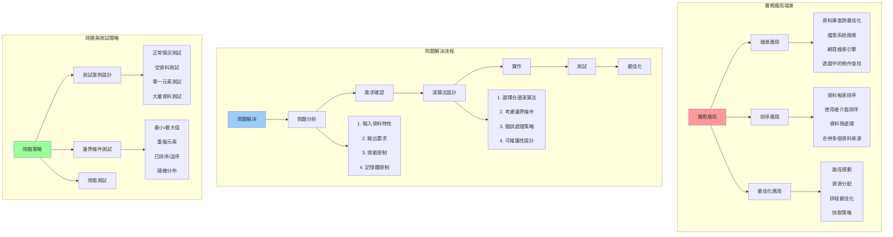
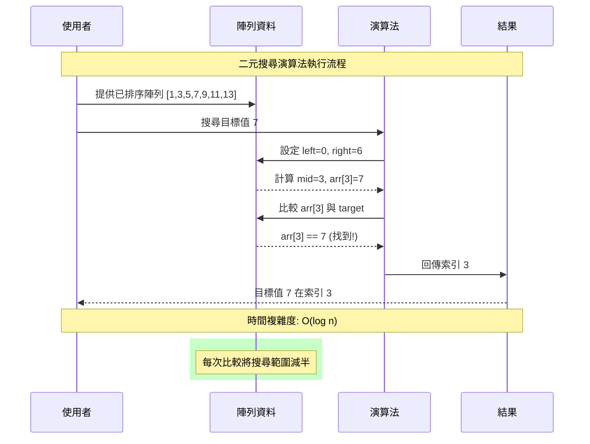

# 邏輯訓練與演算法 - UML概念圖

## 📊 演算法分類與概念架構

```mermaid
graph TB
    subgraph "演算法基本概念"
        Algorithm[演算法] --> Correctness[正確性]
        Algorithm --> Efficiency[效率性]
        Algorithm --> Readability[可讀性]
        Algorithm --> Robustness[健壯性]
        
        Efficiency --> TimeComplexity[時間複雜度]
        Efficiency --> SpaceComplexity[空間複雜度]
        
        TimeComplexity --> BigO[Big O 記號]
        BigO --> O1[O(1) - 常數時間]
        BigO --> On[O(n) - 線性時間]
        BigO --> Ologn[O(log n) - 對數時間]
        BigO --> On2[O(n²) - 平方時間]
    end
    
    subgraph "搜尋演算法"
        SearchAlgorithms[搜尋演算法] --> LinearSearch[線性搜尋]
        SearchAlgorithms --> BinarySearch[二元搜尋]
        SearchAlgorithms --> HashSearch[雜湊搜尋]
        
        LinearSearch --> LSTime[時間: O(n)]
        LinearSearch --> LSSpace[空間: O(1)]
        LinearSearch --> LSCondition[無序資料適用]
        
        BinarySearch --> BSTime[時間: O(log n)]
        BinarySearch --> BSSpace[空間: O(1)]
        BinarySearch --> BSCondition[已排序資料]
        BinarySearch --> DivideConquer[分治策略]
    end
    
    subgraph "排序演算法"
        SortAlgorithms[排序演算法] --> BubbleSort[泡泡排序]
        SortAlgorithms --> SelectionSort[選擇排序]
        SortAlgorithms --> InsertionSort[插入排序]
        
        BubbleSort --> BSStable[穩定排序]
        BubbleSort --> BSTime2[時間: O(n²)]
        BubbleSort --> BSOptimization[優化版本]
        
        SelectionSort --> SSUnstable[不穩定排序]
        SelectionSort --> SSMinSwap[最少交換次數]
        
        InsertionSort --> ISAdaptive[適應性排序]
        InsertionSort --> ISSmallData[小資料集效率高]
        InsertionSort --> ISOnline[線上演算法]
    end
    
    style Algorithm fill:#ff9999
    style SearchAlgorithms fill:#99ccff
    style SortAlgorithms fill:#99ff99
    style TimeComplexity fill:#ffcc99
```

## 🔄 演算法選擇決策流程

```mermaid
flowchart TD
    Start([演算法需求]) --> ProblemType{問題類型}
    
    ProblemType -->|尋找資料| SearchProblem[搜尋問題]
    ProblemType -->|整理資料| SortProblem[排序問題]
    ProblemType -->|其他| OtherProblem[其他演算法]
    
    SearchProblem --> DataState{資料狀態}
    DataState -->|已排序| SortedData[已排序資料]
    DataState -->|未排序| UnsortedData[未排序資料]
    
    SortedData --> BinarySearchChoice[二元搜尋 O(log n)]
    UnsortedData --> LinearSearchChoice[線性搜尋 O(n)]
    
    SortProblem --> SortRequirement{排序需求}
    
    SortRequirement -->|穩定性重要| StableSort[穩定排序需求]
    SortRequirement -->|效能優先| PerformanceSort[效能優先]
    SortRequirement -->|教學目的| EducationalSort[教學演算法]
    
    StableSort --> StableSortChoice[
        泡泡排序 (穩定)<br/>
        插入排序 (穩定)<br/>
        合併排序 (穩定)
    ]
    
    PerformanceSort --> DataSize{資料大小}
    DataSize -->|小資料集| SmallDataSort[插入排序]
    DataSize -->|大資料集| LargeDataSort[快速排序/合併排序]
    
    EducationalSort --> EducationalChoice[
        泡泡排序 (概念清楚)<br/>
        選擇排序 (選擇邏輯)<br/>
        插入排序 (增量建構)
    ]
    
    OtherProblem --> AdvancedAlgorithms[
        遞歸演算法<br/>
        動態規劃<br/>
        圖論演算法<br/>
        字串比對
    ]
    
    BinarySearchChoice --> Implementation[實作演算法]
    LinearSearchChoice --> Implementation
    StableSortChoice --> Implementation
    SmallDataSort --> Implementation
    LargeDataSort --> Implementation
    EducationalChoice --> Implementation
    AdvancedAlgorithms --> Implementation
    
    Implementation --> Testing[測試與驗證]
    Testing --> Optimization[效能最佳化]
    Optimization --> End([完成])
    
    style Start fill:#e1f5fe
    style End fill:#c8e6c9
    style ProblemType fill:#fff3e0
    style DataState fill:#fff3e0
    style SortRequirement fill:#fff3e0
    style DataSize fill:#fff3e0
```

## 📈 演算法效能分析與比較

```mermaid
graph TB
    subgraph "時間複雜度階層"
        ComplexityHierarchy[複雜度階層] --> Constant[O(1) 常數]
        ComplexityHierarchy --> Logarithmic[O(log n) 對數]
        ComplexityHierarchy --> Linear[O(n) 線性]
        ComplexityHierarchy --> Linearithmic[O(n log n) 線性對數]
        ComplexityHierarchy --> Quadratic[O(n²) 平方]
        ComplexityHierarchy --> Exponential[O(2ⁿ) 指數]
        
        Constant --> ConstantExample[陣列存取, HashMap查找]
        Logarithmic --> LogExample[二元搜尋, 平衡樹操作]
        Linear --> LinearExample[線性搜尋, 簡單遍歷]
        Linearithmic --> LinearithmicExample[合併排序, 快速排序平均]
        Quadratic --> QuadraticExample[泡泡排序, 選擇排序]
        Exponential --> ExponentialExample[暴力法, 遞歸費氏數列]
    end
    
    subgraph "演算法比較矩陣"
        ComparisonMatrix[比較矩陣] --> SearchComparison[搜尋演算法比較]
        ComparisonMatrix --> SortComparison[排序演算法比較]
        
        SearchComparison --> SearchTable[
            線性搜尋:<br/>
            - 時間: O(n)<br/>
            - 空間: O(1)<br/>
            - 條件: 無<br/>
            <br/>
            二元搜尋:<br/>
            - 時間: O(log n)<br/>
            - 空間: O(1)<br/>
            - 條件: 已排序
        ]
        
        SortComparison --> SortTable[
            泡泡排序: O(n²), 穩定<br/>
            選擇排序: O(n²), 不穩定<br/>
            插入排序: O(n²), 穩定, 適應性<br/>
            快速排序: O(n log n), 不穩定<br/>
            合併排序: O(n log n), 穩定
        ]
    end
    
    subgraph "最佳情況分析"
        BestCase[最佳情況] --> BestCaseScenarios[
            線性搜尋: 第一個元素 O(1)<br/>
            二元搜尋: 中間元素 O(1)<br/>
            泡泡排序: 已排序 O(n)<br/>
            插入排序: 已排序 O(n)<br/>
            快速排序: 理想分割 O(n log n)
        ]
    end
    
    subgraph "最壞情況分析"
        WorstCase[最壞情況] --> WorstCaseScenarios[
            線性搜尋: 最後或不存在 O(n)<br/>
            二元搜尋: 遞歸到葉子 O(log n)<br/>
            泡泡排序: 逆序 O(n²)<br/>
            插入排序: 逆序 O(n²)<br/>
            快速排序: 最壞分割 O(n²)
        ]
    end
    
    style ComplexityHierarchy fill:#ff9999
    style ComparisonMatrix fill:#99ccff
    style BestCase fill:#99ff99
    style WorstCase fill:#ffcc99
```

## 🎯 學習進度與技能發展

```mermaid
graph LR
    subgraph "基礎階段 (Foundation)"
        F1[演算法概念] --> F2[時間空間複雜度]
        F2 --> F3[線性搜尋理解]
        F3 --> F4[基本排序實作]
    end
    
    subgraph "發展階段 (Development)"
        D1[二元搜尋掌握] --> D2[分治法思想]
        D2 --> D3[排序演算法比較]
        D3 --> D4[演算法最佳化]
        D4 --> D5[穩定性分析]
    end
    
    subgraph "進階階段 (Advanced)"
        A1[複雜度分析] --> A2[演算法設計模式]
        A2 --> A3[資料結構整合]
        A3 --> A4[效能調優]
        A4 --> A5[演算法選擇策略]
    end
    
    subgraph "專家階段 (Expert)"
        E1[高級演算法] --> E2[演算法創新]
        E2 --> E3[演算法研究]
        E3 --> E4[演算法教學]
    end
    
    F4 --> D1
    D5 --> A1
    A5 --> E1
    
    %% 檢查點
    F2 --> Check1{理解Big O?}
    D2 --> Check2{掌握分治法?}
    A2 --> Check3{能設計演算法?}
    
    Check1 -->|否| F2
    Check1 -->|是| F3
    Check2 -->|否| D1
    Check2 -->|是| D3
    Check3 -->|否| A1
    Check3 -->|是| A4
    
    style F1 fill:#c8e6c9
    style D1 fill:#81c784
    style A1 fill:#4caf50
    style E1 fill:#2e7d32
    style Check1 fill:#fff3e0
    style Check2 fill:#fff3e0
    style Check3 fill:#fff3e0
```



## 🔧 實際應用場景與問題解決



## 🧮 演算法視覺化與理解



## 🔗 與其他模組的關聯

```mermaid
graph TD
    LogicTraining[M05: 邏輯訓練與演算法]
    
    %% 前置依賴
    Methods[M01: 方法定義與呼叫] --> LogicTraining
    Collections[M03: 陣列與集合] --> LogicTraining
    OOP[M04: Java 物件導向程式設計] --> LogicTraining
    
    %% 輸出到其他模組
    LogicTraining --> Generics[M06: 泛型程式設計<br/>泛型演算法設計]
    
    %% 實際應用領域
    LogicTraining --> DataStructures[資料結構<br/>樹、圖、雜湊表]
    LogicTraining --> Database[資料庫<br/>查詢最佳化、索引]
    LogicTraining --> WebDev[Web開發<br/>搜尋功能、分頁排序]
    LogicTraining --> GameDev[遊戲開發<br/>AI演算法、碰撞檢測]
    
    %% 進階演算法主題
    LogicTraining --> AdvancedAlgorithms[進階演算法<br/>動態規劃、圖論]
    LogicTraining --> MachineLearning[機器學習<br/>分類、聚類演算法]
    LogicTraining --> Cryptography[密碼學<br/>加密演算法]
    
    %% 效能與最佳化
    LogicTraining --> PerformanceAnalysis[效能分析<br/>Profiling、Benchmarking]
    LogicTraining --> SystemDesign[系統設計<br/>可擴展性、負載平衡]
    LogicTraining --> CompetitiveProgramming[競程<br/>ACM、Codeforces]
    
    %% 工具與框架
    LogicTraining --> TestingFrameworks[測試框架<br/>JUnit、效能測試]
    LogicTraining --> Visualization[視覺化工具<br/>演算法動畫]
    LogicTraining --> Documentation[技術文件<br/>演算法說明]
    
    style LogicTraining fill:#ff9999
    style Methods fill:#e1f5fe
    style Collections fill:#e3f2fd
    style OOP fill:#fff3e0
    style Generics fill:#ff99cc
    style DataStructures fill:#81c784
    style AdvancedAlgorithms fill:#ffab40
    style PerformanceAnalysis fill:#ba68c8
```

