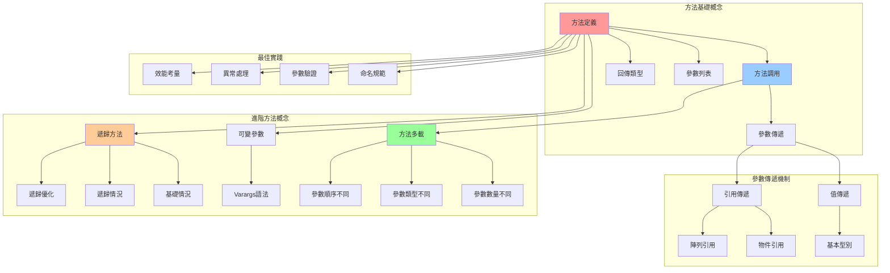
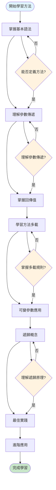
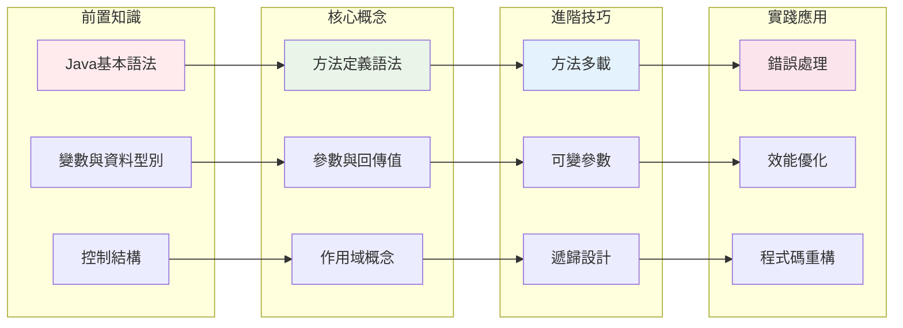
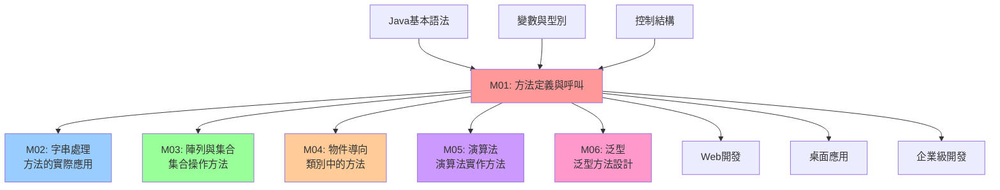

# 方法定義與呼叫 - UML概念圖

## 📊 模組概念關係圖



## 🔄 學習流程圖



## 🎯 知識點依賴關係



## 📈 複雜度與應用層次

```mermaid
pyramid TB
    subgraph "高級應用 (Advanced)"
        Level4[遞歸演算法<br/>效能優化<br/>設計模式]
    end
    
    subgraph "中級應用 (Intermediate)"  
        Level3[方法多載<br/>可變參數<br/>異常處理]
    end
    
    subgraph "基礎應用 (Basic)"
        Level2[參數傳遞<br/>回傳值處理<br/>作用域管理]
    end
    
    subgraph "入門概念 (Foundation)"
        Level1[方法定義<br/>方法調用<br/>基本語法]
    end
    
    Level1 --> Level2
    Level2 --> Level3  
    Level3 --> Level4
    
    style Level1 fill:#c8e6c9
    style Level2 fill:#81c784
    style Level3 fill:#4caf50
    style Level4 fill:#2e7d32
```

## 🔗 與其他模組的關聯

