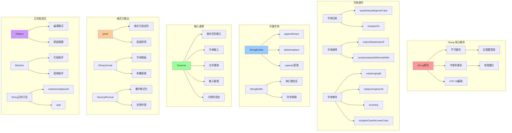
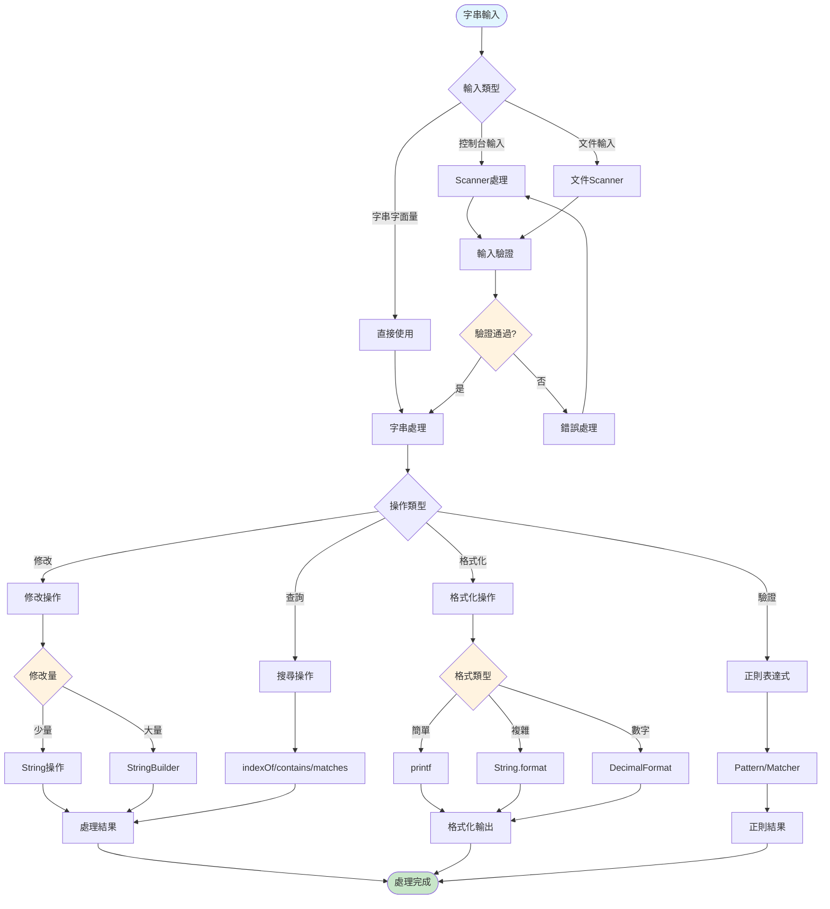
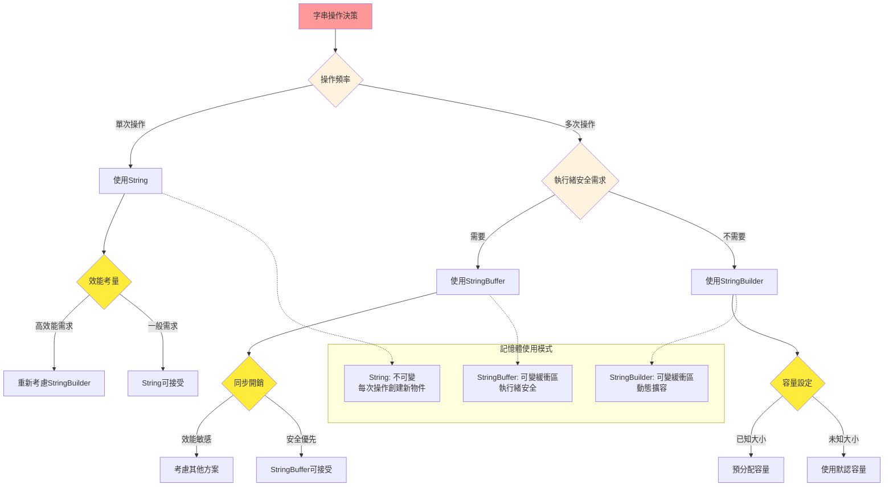
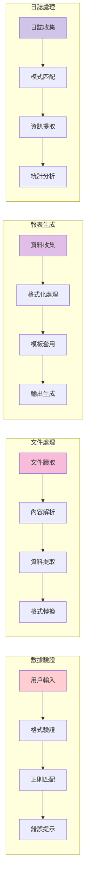
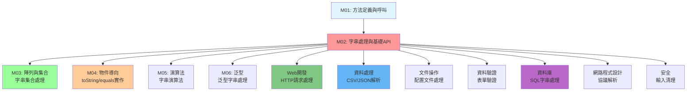

# 字串處理與基礎API - UML概念圖

## 📊 模組概念關係圖



## 🔄 字串處理工作流程



## 🎯 效能考量與選擇決策



## 📈 學習進度與技能層次

```mermaid
pyramid TB
    subgraph "專家級 (Expert)"
        Level5[正則表達式高級應用<br/>效能調優與記憶體管理<br/>文本處理框架設計]
    end
    
    subgraph "高級 (Advanced)"
        Level4[複雜正則表達式<br/>文件處理與解析<br/>國際化處理]
    end
    
    subgraph "中級 (Intermediate)"
        Level3[StringBuilder最佳化<br/>格式化輸出控制<br/>基礎正則表達式]
    end
    
    subgraph "初級 (Basic)"
        Level2[String基本操作<br/>Scanner輸入處理<br/>簡單格式化]
    end
    
    subgraph "入門 (Foundation)"
        Level1[String創建與比較<br/>基本字串方法<br/>控制台輸出]
    end
    
    Level1 --> Level2
    Level2 --> Level3
    Level3 --> Level4
    Level4 --> Level5
    
    style Level1 fill:#c8e6c9
    style Level2 fill:#81c784
    style Level3 fill:#4caf50
    style Level4 fill:#2e7d32
    style Level5 fill:#1b5e20
```

## 🛠️ 實際應用場景流程



## 🔗 與其他模組的整合關係

